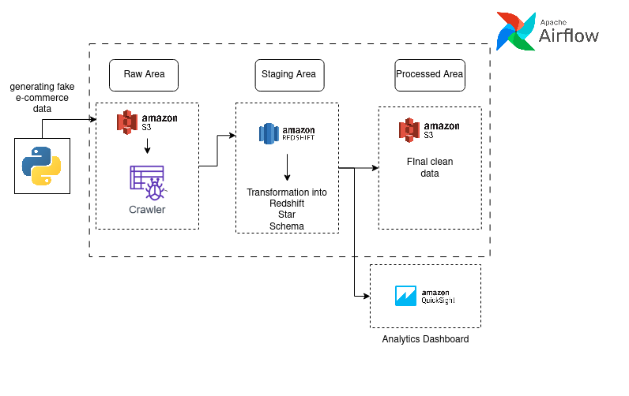
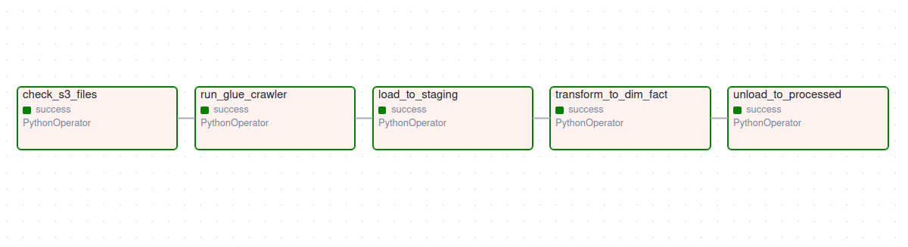
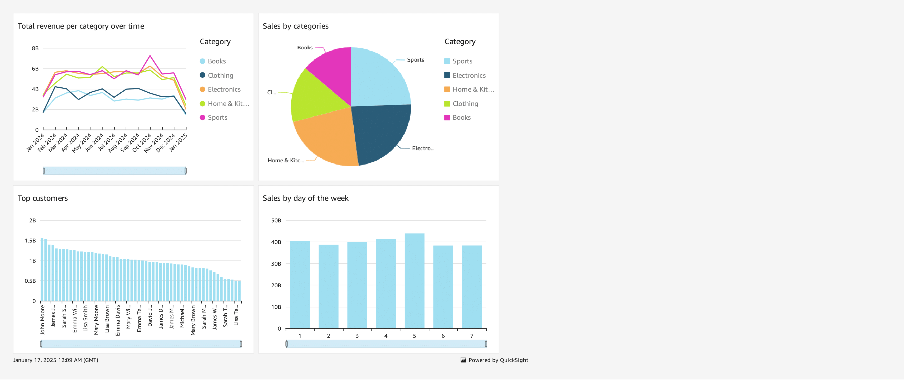

# 🛍️ Retail Analytics Data Pipeline

## 🎯 Project Overview
A comprehensive ETL (Extract, Transform, Load) pipeline built on AWS cloud services for retail analytics. This project processes retail transaction data, implements a star schema for efficient analytics, and provides business insights through interactive dashboards.

## 💡 Business Context
The pipeline processes retail data including:
- Customer information
- Product details
- Sales transaction

## 🏗️ Technical Architecture

### Data Flow
1. **Data Generation Layer**
   - Python script generates sample retail datasets
   - Creates customers, products, and orders data
   - Outputs CSV files

2. **Storage Layer**
   - **S3 Data Lake** with three zones:
     - Raw: Original CSV files
     - Staging: Intermediate processing
     - Processed: Transformed data

3. **Processing Layer**
   - **AWS Glue** for schema discovery
   - **Amazon Redshift** for data warehousing
     - Staging tables for initial load
     - Star schema for analytics

4. **Orchestration Layer**
   - **Apache Airflow** managing the ETL workflow
   - DAG with 5 main tasks
   - Automated daily runs

5. **Analytics Layer**
   - **Amazon QuickSight** dashboards
   - Interactive visualizations
   - Business metrics

## 📊 Data Model

### Source Data
- customers.csv
- products.csv
- orders.csv

### Star Schema
- **Fact Table**
  - fact_orders (order details, quantities, amounts)

- **Dimension Tables**
  - dim_customers (customer demographics)
  - dim_products (product information)
  - dim_date (time-based analysis)

## ⚙️ ETL Pipeline

### Airflow DAG Tasks

1. **check_s3_files**
   - Validates presence of source files
   - Ensures data completeness

2. **run_glue_crawler**
   - Updates metadata catalog
   - Discovers schema changes

3. **load_to_staging**
   - Copies data from S3 to Redshift staging
   - Preserves source data integrity

4. **transform_to_dim_fact**
   - Populates dimension tables
   - Builds fact table with proper keys
   - Implements star schema

5. **unload_to_processed**
   - Exports transformed data
   - Maintains processed data zone

## 📈 Analytics & Dashboards

- Total revenue per category over time
- Sales by product category
- Top customers
- Sales by days of the week

